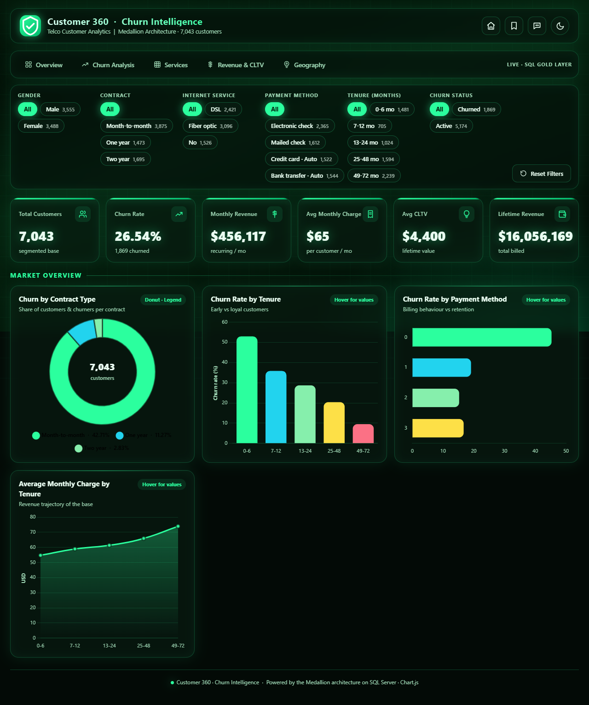
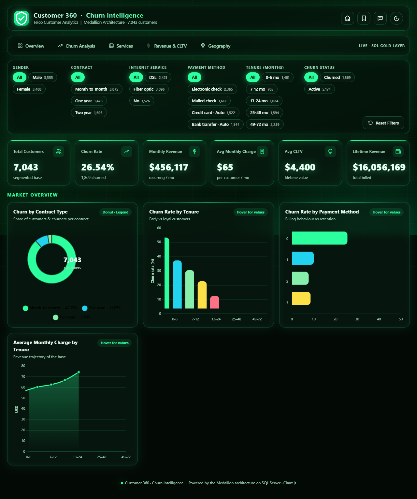
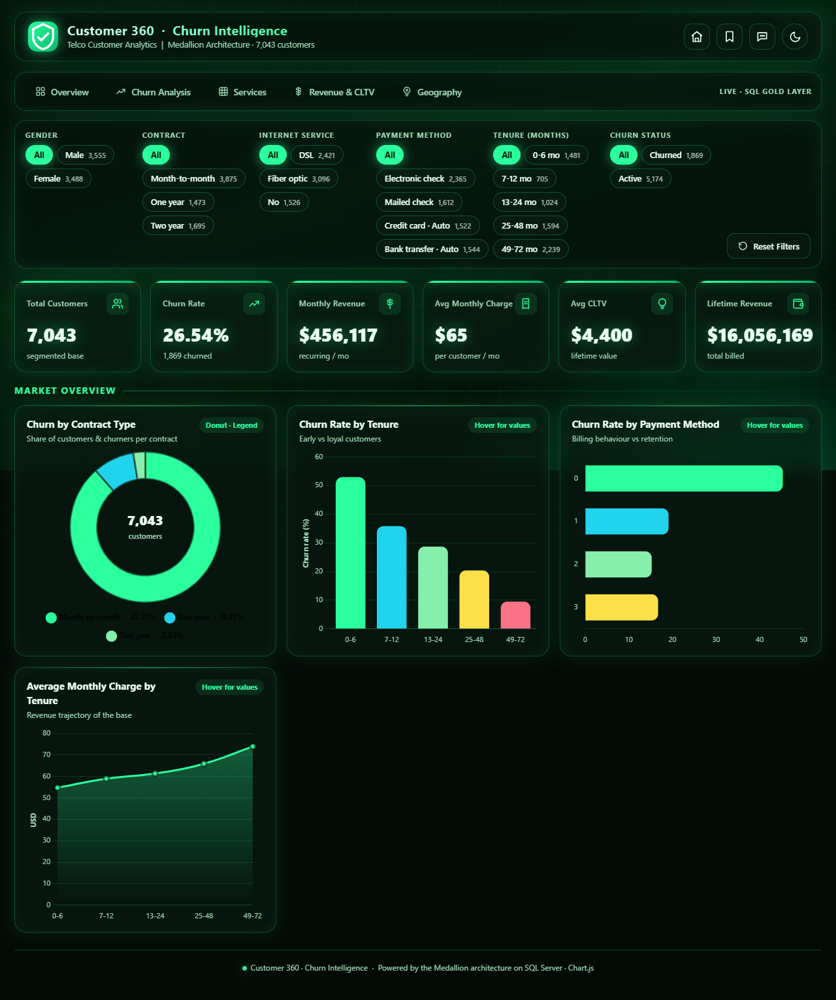
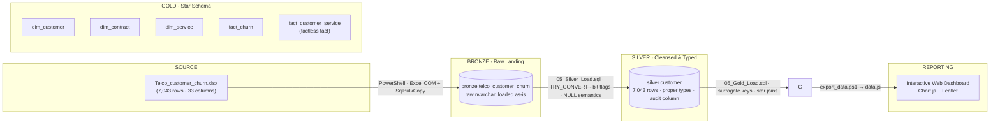
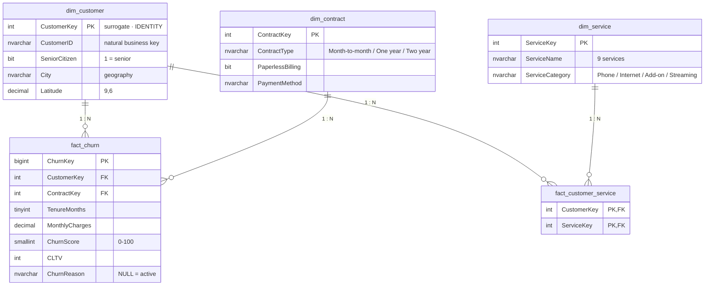

<div align="center">

# Churn360 — Telco Customer Churn Intelligence Platform

**From raw Excel → Medallion Data Warehouse on SQL Server → Interactive Web Dashboard**


-2bff9e?style=for-the-badge)


_Analyze churn · Pinpoint risk · Save revenue_

</div>

---

##  Overview

**Churn360** is an end-to-end analytics project that answers a classic business question — **"Why do our customers leave, who is at risk, and what is that costing us?"** — by taking raw Telco subscriber data and pushing it all the way through a production-grade analytical stack:

1. **Land** a raw Excel source (7,043 customers · 33 columns) into SQL Server **as-is** — *Bronze*.
2. **Conform & type** it into a single, clean, audit-trailed table — *Silver*.
3. **Model** it into a **star schema** (dimensions + facts, including a *factless fact*) for reporting — *Gold*.
4. **Visualize** it through a premium, theme-aware, interactive **web dashboard** with page-specific KPIs, cross-filtering slicers, a question-answering engine, and a live **churn field-map**.

Every layer is fully documented, **idempotent**, and reproducible — designed like a real enterprise BI deployment, not a toy demo.

---

##  Dashboard

| Holographic Dark | Apple-style Light | Geography Field-Map |
|:---:|:---:|:---:|
|  |  |  |

> Charts, legends, gridlines and text **auto-contrast with the theme** — light-on-dark in holographic mode, dark-on-light in Apple mode.

---

##  Screenshots

Real captures from the running dashboard (original files preserved in `Dashboard Images/`).

**Holographic Dark theme**

| | | | |
|---|---|---|---|
|  |  |  |  |
|  |  |  |  |

**Apple-style Light theme**

| | | | |
|---|---|---|---|
|  |  |  |  |
|  | | | |

---

##  Architecture



### The star schema



**Why a *factless* fact?** Services are many-to-many with customers. Storing one row per *customer × service subscription* (29,202 rows) lets the dashboard count "customers with Tech Support", "streaming adoption", or "service mix vs churn" without wide, sparse flag columns.

---

##  Tech Stack

| Layer | Technology |
|---|---|
| Database | Microsoft SQL Server (Windows Auth, `TrustServerCertificate=true`) |
| Raw ingestion | PowerShell · Excel COM + `SqlBulkCopy` |
| Transformation | T-SQL (idempotent DDL/DML, `TRY_CONVERT`, typed conversions) |
| Modeling | Medallion: Bronze → Silver → Gold star schema |
| Reporting | `index.html` · Chart.js 4.4 · Leaflet 1.9 (OpenStreetMap/CARTO basemaps) |
| Data feed to UI | `export_data.ps1` → self-contained `data.js` |
| Themes | CSS custom properties · dual dark/light design system |

---

##  Repository Structure

```
Churn360/
├── Telco_customer_churn.xlsx        # source dataset (7,043 rows)
├── etl/
│   ├── 00_Create_Database.sql       # creates Customer_Analysis DB
│   ├── 01_Create_Schemas.sql        # bronze / silver / gold schemas
│   ├── 02_Bronze_Create.sql         # raw landing table
│   ├── 03_Silver_Create.sql         # conformed, typed table
│   ├── 04_Gold_Create.sql           # star schema (dims + facts)
│   ├── 05_Silver_Load.sql           # typed ETL into silver
│   ├── 06_Gold_Load.sql             # star-schema load
│   ├── Customer_Analysis_Medallion.sql   # monolithic, fully-commented script
│   ├── load_bronze.ps1              # Excel → bronze (COM + SqlBulkCopy)
│   ├── load_silver.ps1              # silver load (long-running friendly)
│   ├── load_gold.ps1                # gold load
│   └── load_gold_facts.ps1          # facts load (CommandTimeout 300)
├── dashboard/
│   ├── index.html                   # 5 analytical pages
│   ├── css/style.css                # theme design system
│   ├── js/app.js                    # rendering, KPIs, Q&A, slicers, map
│   ├── data.js                      # generated data feed (don't hand-edit)
│   └── export_data.ps1              # SQL → data.js exporter
└── assets/                          # README screenshots
```

---

##  The Pipeline: SQL Server → Interactive Dashboard

### Step 1 — Land the raw source (Bronze)

`load_bronze.ps1` reads the Excel workbook (Excel COM → `UsedRange.Value2`), converts headers to `snake_case`, sizes every column from actual max length, and bulk-loads the **raw** data with `SqlBulkCopy`.

- **`bronze.telco_customer_churn`** — 7,043 rows · 33 columns, all `nvarchar`, kept **as-is** (no interpretation yet).
- Why PowerShell + COM? The source is `.xlsx`; PowerShell drives Excel directly and streams the buffer to SQL Server in one pass (~seconds, no BCP export file needed).

### Step 2 — Clean, type & conform (Silver)

`05_Silver_Load.sql` produces a single record-per-customer table **`silver.customer`**:

- Correct types: `decimal(10,2)` money, `tinyint` tenure, `smallint` churn score, `int` CLTV, `bit` for every Yes/No flag.
- **NULLs are meaningful**: `total_charges NULL` = brand-new customer (0 tenure, 11 of them); `churn_reason NULL` = still active (5,174).
- 3-value service semantics preserved (`Yes / No / No internet service`), with `Yes/No → bit` and service-tier strings kept.
- Audit column `dwh_create_date` stamped by the load.

### Step 3 — Model for reporting (Gold)

`06_Gold_Load.sql` builds the **star schema** with `IDENTITY` surrogate keys:

| Gold table | Rows | Role |
|---|---|---|
| `dim_customer` | 7,043 | demographics + geography |
| `dim_contract` | 24 | contract × billing × payment |
| `dim_service` | 9 | service catalog (Phone / Internet / Add-on / Streaming) |
| `fact_churn` | 7,043 | subscription snapshot + churn outcome |
| `fact_customer_service` | 29,202 | **factless fact** — subscription matrix |

>  Facts take a few minutes to load — the PowerShell loaders set `CommandTimeout = 300` and the SQL runs are split so nothing times out.

### Step 4 — Feed the dashboard

`export_data.ps1` queries the Gold layer, emits **`dashboard/data.js`** (a self-contained `CHURN_DATA` array with coordinates and typed values), and the dashboard reads it straight from the browser — no API server required. Open `dashboard/index.html` and it just works.

---

## 🧠 Key Business Insights (computed from the model)

- **26.54%** overall churn — **1,869 of 7,043** customers.
- **Contract is the #1 churn driver**: Month-to-month churns at **42.7%** vs **11.3%** (One year) and **2.8%** (Two year).
- **Top reason for leaving: "Attitude of support person"** (192 churners) — a *service-quality* problem, not a price problem.
- **950 currently-active customers are high-risk** (churn score ≥ 70) — an estimated **~$61K/month** exposure if not retained.
- **$139,131/month in revenue is already at risk** from the churned base.
- **Internet Service is the churniest product line** (31.8%) while **Online Security retains best** (14.6%).
- **CLTV ≈ 67.95× the monthly charge** — every point of churn-rate reduction compounds real value.
- All 7,043 customers are in **California** (1,129 cities · 1,652 zip codes) — **La Puente** churns at 70%.

---

##  Page-Specific KPIs

Each dashboard page surfaces **business KPIs tuned to that page's focus** (computed live against the filtered set):

| Page | KPIs |
|---|---|
| **Overview** | Total Customers · Churn Rate · Monthly Revenue · Avg Monthly Charge · Avg CLTV · Lifetime Revenue |
| **Churn Analysis** | Churned · Active · Avg Churn Score · **High-Risk Active (≥70)** · Revenue at Risk · **Top Churn Reason** |
| **Services** | Active Subscriptions · Avg Add-ons/Customer · **Best Retaining Service** · **At-Risk Service** · Streaming Adoption · Security Suite |
| **Revenue & CLTV** | Monthly Revenue · Lifetime Revenue · Avg Monthly · Avg CLTV · **Top Revenue Contract** · **CLTV × Monthly** |
| **Geography** | States · Cities · Zip Codes · **Top City** · **Top Zip** · **High-Churn City** |

---

##  Getting Started

### Prerequisites
- **Microsoft SQL Server** (any 2016+ edition; Windows Auth on `localhost`)
- **PowerShell 5.1+** with **Excel** installed (for the COM loader) 
- Optionally **Python/Node** only if you want to serve the dashboard over HTTP (`python -m http.server`) — otherwise just open `index.html`
- **Internet access** for CDN assets (Chart.js / Leaflet / map tiles)

### 1 · Provision the database
```powershell
# update connection strings in the scripts to your server if needed
sqlcmd -S localhost -E -C -b -i etl\00_Create_Database.sql
sqlcmd -S localhost -d Customer_Analysis -E -C -b -i etl\01_Create_Schemas.sql
sqlcmd -S localhost -d Customer_Analysis -E -C -b -i etl\02_Bronze_Create.sql
sqlcmd -S localhost -d Customer_Analysis -E -C -b -i etl\03_Silver_Create.sql
sqlcmd -S localhost -d Customer_Analysis -E -C -b -i etl\04_Gold_Create.sql
```

### 2 · Load data
```powershell
.\etl\load_bronze.ps1      # Excel → bronze.telco_customer_churn
sqlcmd -S localhost -d Customer_Analysis -E -C -b -i etl\05_Silver_Load.sql
sqlcmd -S localhost -d Customer_Analysis -E -C -b -i etl\06_Gold_Load.sql
```
> On your machine, update the `$sourceFile` path in `load_bronze.ps1` (and the connection strings) to match your environment. Every script is **idempotent** — safe to re-run.

### 3 · Run the dashboard
```powershell
# refresh the data feed (optional — data.js ships pre-built)
.\dashboard\export_data.ps1

# serve it (or just double-click dashboard\index.html)
python -m http.server 8899 --directory dashboard
# → http://localhost:8899
```

---

##  Interactivity

- **6 cross-filter slicers** — Gender · Contract · Internet Service · Payment Method · Tenure · Churn Status — every chart, KPI and the map re-aggregate live.
- **5 pages** with their own charts + KPIs.
- **Theme toggle** — holographic dark / Apple-style light, persisted + bookmarked.
- **Q&A engine** — ask questions in plain English ("Top churn reasons", "How much revenue is at risk?") and get computed answers.
- **Bookmark view** — saves theme, page and filters.
- **Churn field-map** — 1,652 zip-level markers; circle size = customers, **green intensity + glow** = churn rate; dark surface in dark theme, light surface in light theme.

---

##  Design Decisions & Trade-offs

| Decision | Why |
|---|---|
| Medallion layers kept **separate schemas** | Auditable lineage; raw data is never destroyed by re-processing |
| Silver = single table (not typed per domain) | Source is a flat single-entity file; one conformed table keeps joins simple |
| **Factless fact** for services | Correct many-to-many modeling instead of 9 sparse columns |
| `dim_date` **omitted** | The data is a point-in-time snapshot — no business dates to join |
| PowerShell + `SqlBulkCopy` for Excel | No staging files, one pass, milliseconds-scale loads |
| `CommandTimeout = 300` on facts | Star-schema load is heavy; standard timeout would abort it |
| `data.js` ships committed | Dashboard works with **zero backend** — open the file, done |

---

##  Roadmap

- [x] Medallion warehouse + reproducible ETL
- [x] Interactive dashboard with 5 pages & dual themes
- [x] Churn field-map with intensity glow
- [ ] Power BI semantic model on the same Gold layer
- [ ] Incremental/CDC loads (replace full reloads)
- [ ] CI for the pipeline (SQL unit tests + lint)
- [ ] Deployment: Azure SQL + static hosting

---

##  Contributing

Found a bug or want a new page? Open an issue or a PR — the pipeline is designed to be extended one layer at a time.

## 📄 License

[MIT](LICENSE) © 2026 Himanshu Upadhyay

---

<div align="center">
  <sub>Built with the Medallion architecture on SQL Server · Chart.js · Leaflet</sub>
</div>
